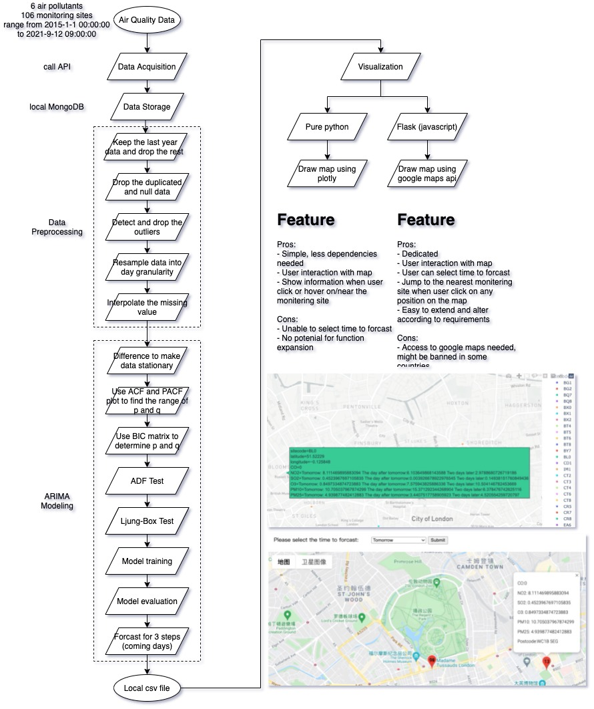
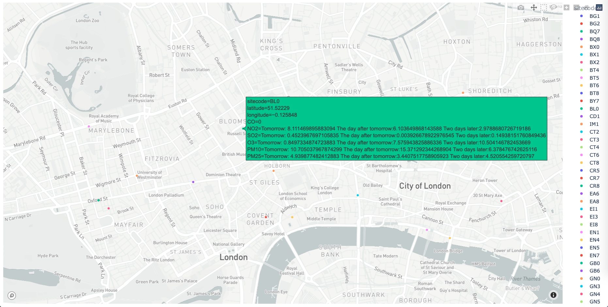
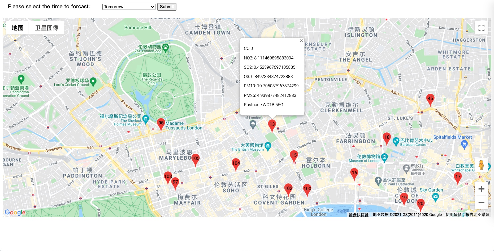

# The Smart Building & City Lens

This repo serves as the code implementation of the project assigned in the module ELEC0054 in the Department of Electronic and Electrical Engineering in UCL.

## Overview of Methodology



## Requirements

* Python 3.7+ (Python 3.7.11 is recommended which is the version used in the development.)
* Required modules
  * check *requirement.txt* to ensure all modules included have been installed
  * or run `pip3 install -r requirements.txt` in terminal to install with ease

## Usage

1. Clone this repo into your local directory.

```bash
git clone https://github.com/UCL-SmartCity/Air-quality-forcast-and-visualization.git <dir_path>
```

2. Download the database backup from [Google Drive](https://drive.google.com/drive/folders/1tVws0YnGjNyAAJ8k_01X1UnyXa7xrvdv?usp=sharing) and restore locally using the command below.

```bash
mongorestore -h 127.0.0.1:27017 -d ucl-smartcity <folder_path>
```

3. Run `database_update/main.py` to update the air quality and weather data to the latest.

```bash
cd <dir_path>/database_update
python3 main.py
```

4. Run `forcast.ipynb` to carry out a series of data preprocessing and modeling process. Need to mention that the *Data Analysis and Modeling (demo)* section in the notebook is for the propose of detailed illustration of the whole procedure and not necessary to run. Skip it for a quick run.
5. Run `visualization(pure_py)` to visualize the data using plotly. A website will open automatically to show the mapping.



6. Run `visualization(py+js)` to visualize the data using Google Maps API. Open the url `http://0.0.0.0:5000/` in your brower to see the mapping.



## Having problems?

If you run into problems, please either file a github issue or send an email to [uceewta@ucl.ac.uk](mailto:uceewta@ucl.ac.uk).
